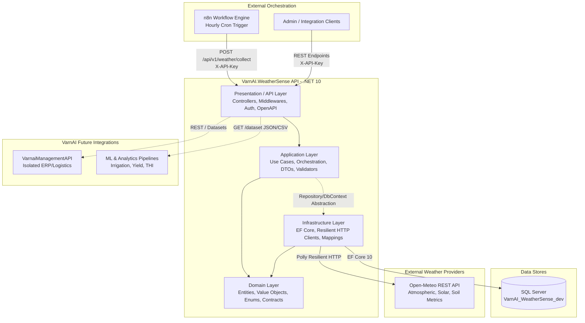
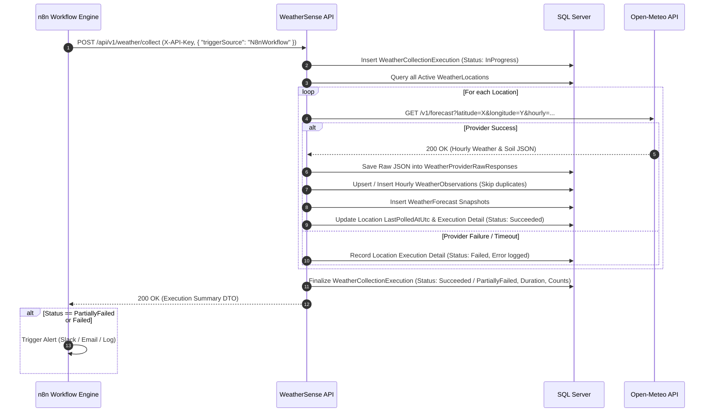

# VarnAI WeatherSense — Architecture Documentation

## 1. Architectural Overview

**VarnAI WeatherSense** is a standalone, production-grade microservice built on **.NET 10** for VarnAI Farm Fresh Private Limited. Its primary mission is the automated, high-frequency collection, normalization, immutable historical archiving, forecast snapshot preservation, and high-performance querying of microclimate, soil, and weather intelligence.

The service serves as the environmental data backbone for VarnAI's precision agriculture, livestock management (dairy heat stress analytics), supply chain planning, and future machine learning models.



---

## 2. Strict Isolation Boundary

A foundational architectural constraint of the VarnAI ecosystem is **complete physical and logical separation** between VarnAI WeatherSense and the existing Varnai ERP/Management system:

| Aspect | Existing System (`VarnaiManagementAPI`) | VarnAI WeatherSense (`VarnAI.WeatherSense`) |
| :--- | :--- | :--- |
| **Solution** | `C:\Users\rmkar\...\VarnaiManagementAPI.sln` | `C:\Users\rmkar\...\VarnAI.WeatherSense.sln` |
| **Database** | `VarnaiManagement_dev` (SQL Server) | `VarnAI_WeatherSense_dev` (SQL Server) |
| **Port / Base URL**| `http://localhost:5246` | `http://localhost:5270` (or Docker port 8085) |
| **Data Models** | Sales, inventory, customers, milk deliveries | Geolocation, observations, forecasts, executions, soil metrics |
| **Authentication**| Firebase JWT / User Token | Machine-to-Machine Secret `X-API-Key` |
| **Coupling** | **Zero direct code, project, or database references** | **Zero direct code, project, or database references** |

Future inter-service communication between `VarnaiManagementAPI` and `VarnAI.WeatherSense` will occur strictly via authenticated REST APIs, asynchronous messaging (e.g., Azure Service Bus / RabbitMQ), or data warehousing feeds.

---

## 3. Clean Architecture Implementation

The solution strictly adheres to **Clean Architecture** (Ports and Adapters / Onion Architecture) principles, dividing responsibilities into four distinct projects:

```
src/
├── VarnAI.WeatherSense.Domain/           # Enterprise core (Entities, Enums, Domain Rules)
├── VarnAI.WeatherSense.Application/      # Use cases, DTOs, Interfaces, Validators, Service Logic
├── VarnAI.WeatherSense.Infrastructure/   # DBContext, Migrations, Resilient HTTP Provider, Configurations
└── VarnAI.WeatherSense.API/              # Controllers, Middlewares, DI Setup, OpenAPI, Health Checks
tests/
├── VarnAI.WeatherSense.UnitTests/        # 38 Fast Unit Tests (Domain, Mapping, Aggregations, Validation)
└── VarnAI.WeatherSense.IntegrationTests/ # 7 In-Memory Integration Tests (API Endpoints, Pipelines, Health)
```

### 3.1 Domain Layer (`VarnAI.WeatherSense.Domain`)
- **No external dependencies** except core .NET libraries.
- Encapsulates domain entities:
  - `WeatherLocation`: Farm, polyhouse, or delivery hub coordinates, elevation, and metadata.
  - `WeatherObservation`: Hourly physical recordings (temperature, humidity, precipitation, wind, solar radiation, soil temperature, soil moisture across 4 depths).
  - `WeatherForecast`: Snapshot-preserving hourly and daily prognostic projections.
  - `WeatherCollectionExecution`: Audit ledger for every collection run (status, counts, timings, errors).
  - `WeatherLocationExecutionDetail`: Per-location breakdown of collection performance.
  - `WeatherProviderRawResponse`: Immutable raw JSON payloads for regulatory audit and replayability.
- Enums: `WeatherCondition`, `CollectionExecutionStatus`, `CollectionTriggerSource`, `WeatherDataSource`.

### 3.2 Application Layer (`VarnAI.WeatherSense.Application`)
- Orchestrates application business workflows:
  - `IWeatherCollectionService`: Implements multi-location, resilient weather collection. Ensures that failure of a single external coordinate does not abort execution for remaining locations.
  - `IWeatherQueryService`: Computes high-efficiency aggregations, paginated historical time-series, latest snapshots, and ML-ready flat datasets.
  - `IWeatherLocationService`: Manages farm location lifecycle with geocoordinate validation.
- Validates inputs using **FluentValidation** (`LocationCreateDtoValidator`, `WeatherCollectionRequestDtoValidator`).
- Defines repository and abstraction interfaces (`IWeatherSenseDbContext`, `IWeatherProvider`, `IDateTimeProvider`).
- Implements comprehensive WMO weather code mapping (`WeatherCodeMapper`) covering all standard World Meteorological Organization weather states.

### 3.3 Infrastructure Layer (`VarnAI.WeatherSense.Infrastructure`)
- Implements database persistence via **Entity Framework Core 10** (`WeatherSenseDbContext`).
- Uses dedicated Fluent API entity type configurations with explicit SQL schemas, table names, precision/scale specifications (`decimal(9,6)`, `decimal(5,2)`), and composite unique indexes.
- Implements `IWeatherProvider` via `OpenMeteoWeatherProvider`, integrating:
  - `IHttpClientFactory` for managed socket pooling.
  - `AddStandardResilienceHandler()` from `Microsoft.Extensions.Http.Resilience` for rate-limiting, exponential backoff retries, and circuit breaking.
- Houses database migrations targeting SQL Server.

### 3.4 Presentation / API Layer (`VarnAI.WeatherSense.API`)
- Exposes versioned RESTful endpoints (`/api/v1/...`).
- Custom Middleware Pipeline:
  1. `CorrelationIdMiddleware`: Generates or propagates `X-Correlation-ID` across logs and HTTP response headers.
  2. `ApiKeyAuthMiddleware`: Validates `X-API-Key` on all protected endpoints, gracefully allowing anonymous access to `/health` and `/swagger`.
  3. `ExceptionHandlingMiddleware`: Translates unhandled exceptions into RFC 7807 `ProblemDetails` specifications.
- Comprehensive Health Checks:
  - `/health`: Liveness probe.
  - `/health/ready`: Readiness probe verifying SQL Server connectivity.
  - `/health/live`: Basic runtime responsive check.
- OpenAPI / Swagger integration configured with `X-API-Key` security schemes.

---

## 4. Headless Automation Philosophy (No In-App Background Schedulers)

### Why No Hangfire, Quartz.NET, or `BackgroundService`?
Many monolithic applications embed background workers (e.g. Quartz or Hangfire) inside the Web API host. In modern cloud and enterprise architectures, this pattern introduces severe operational drawbacks:
1. **Thread Pool Starvation**: Intense collection and JSON parsing cycles degrade user-facing REST latency.
2. **Horizontal Scaling Race Conditions**: Scaling out the API across multiple containers or instances requires complex distributed locks to prevent duplicate data polling.
3. **Deployment Restarts**: Rolling API deployments interrupt in-flight scheduled tasks mid-execution.
4. **Visibility & Alerting Gaps**: In-process schedulers lack low-code retry graphs, multi-channel alerting (Slack, PagerDuty, WhatsApp), and centralized orchestration dashboards.

### The n8n Headless Webhook Solution
VarnAI WeatherSense externalizes orchestration to **n8n**:
- The API is **purely headless and reactive**.
- Collection is triggered via `POST /api/v1/weather/collect`.
- n8n manages schedule intervals (e.g., cron every hour), retries on network drops, and notifies farm operators via webhooks if an execution reports `Failed` or `PartiallyFailed`.
- Manual on-demand collections can be initiated at any time by admins or data pipelines without interfering with regular cron schedules.



---

## 5. Resilience & Fault Tolerance Strategy

1. **Multi-Location Fault Isolation**: Weather collection iterates over active farm locations sequentially or concurrently using `try/catch` perimeters. If Open-Meteo times out or fails on Location 2, Location 1 and Location 3 are committed successfully, and the overall execution status is marked `PartiallyFailed`.
2. **Duplicate Prevention**: EF Core queries the latest observation timestamps before persisting records. Existing records with identical `(LocationId, TimestampUtc)` are safely skipped.
3. **Snapshot Immutability**: Forecasts are never overwritten. Each collection run records a distinct `ForecastSnapshotUtc`, creating a historical timeline of how meteorological forecasts evolved over time.
4. **HTTP Resilience Handler**: OpenMeteo HTTP client leverages Polly-based `AddStandardResilienceHandler()`, providing:
   - Rate limiting.
   - 3 exponential backoff retries with jitter for transient network failures (HTTP 429, 500, 502, 503, 504).
   - Circuit breaking to prevent cascading provider saturation.
