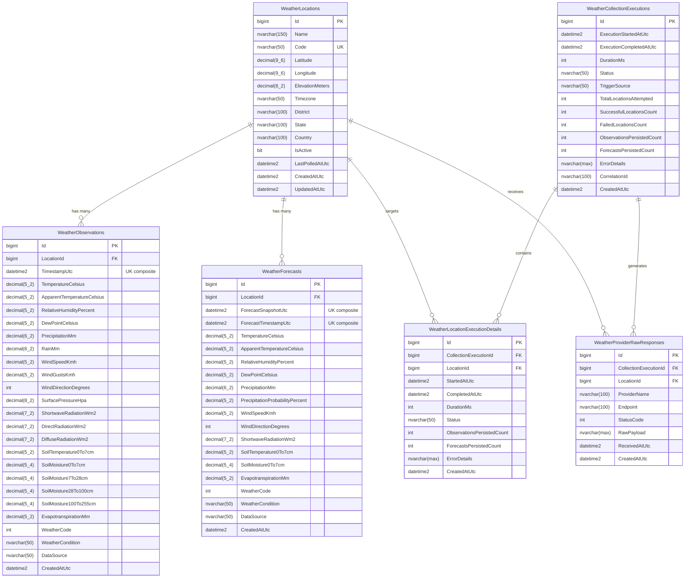

# VarnAI WeatherSense — Database Documentation

## 1. Overview & Principles

**VarnAI WeatherSense** persists environmental intelligence in a dedicated Microsoft SQL Server database:
- **Development Database**: `VarnAI_WeatherSense_dev`
- **Production Database**: `VarnAI_WeatherSense`

The database schema is engineered for:
1. **High-Frequency Time-Series Archiving**: Optimized for sequential inserts of hourly observations across hundreds of locations.
2. **Forecast Snapshot Preservation**: Preserving meteorological predictions made at specific snapshot times, enabling post-hoc forecast accuracy evaluation.
3. **Auditability & Replayability**: Complete execution tracking and raw payload retention.
4. **Data Integrity**: Enforced through foreign keys, strict nullability, precise numeric scale/precision, and unique composite indexes.

---

## 2. Entity-Relationship Diagram



---

## 3. Table Schema Specifications

### 3.1 `WeatherLocations`
Represents registered farms, delivery hubs, polyhouses, or collection centers.

| Column | Type | Nullable | Description |
| :--- | :--- | :--- | :--- |
| `Id` | `bigint` | NO | Primary Key, Identity(1,1) |
| `Name` | `nvarchar(150)` | NO | Descriptive farm name (e.g. "VarnAI Farm Alpha - Pollachi") |
| `Code` | `nvarchar(50)` | NO | Unique business lookup code (e.g. "LOC-FARM-001") |
| `Latitude` | `decimal(9,6)` | NO | WGS84 Latitude (-90.000000 to +90.000000) |
| `Longitude` | `decimal(9,6)` | NO | WGS84 Longitude (-180.000000 to +180.000000) |
| `ElevationMeters` | `decimal(8,2)` | YES | Altitude above sea level in meters |
| `Timezone` | `nvarchar(50)` | NO | IANA Timezone identifier (default: "Asia/Kolkata") |
| `District` | `nvarchar(100)` | YES | Administrative district (e.g. "Coimbatore") |
| `State` | `nvarchar(100)` | YES | State or province (e.g. "Tamil Nadu") |
| `Country` | `nvarchar(100)` | NO | Country name (e.g. "India") |
| `IsActive` | `bit` | NO | Soft-delete / collection toggle flag |
| `LastPolledAtUtc` | `datetime2` | YES | Timestamp of last successful weather collection |
| `CreatedAtUtc` | `datetime2` | NO | Creation timestamp |
| `UpdatedAtUtc` | `datetime2` | YES | Last modification timestamp |

- **Indexes**:
  - `PK_WeatherLocations`: Clustered (`Id`)
  - `IX_WeatherLocations_Code`: Unique Non-Clustered (`Code`)
  - `IX_WeatherLocations_IsActive`: Filtered Non-Clustered (`IsActive`)

---

### 3.2 `WeatherObservations`
Stores historical and current actual hourly recordings.

| Column | Type | Nullable | Description |
| :--- | :--- | :--- | :--- |
| `Id` | `bigint` | NO | Primary Key, Identity(1,1) |
| `LocationId` | `bigint` | NO | Foreign Key -> `WeatherLocations.Id` (Cascade Delete) |
| `TimestampUtc` | `datetime2` | NO | Observation time in UTC |
| `TemperatureCelsius` | `decimal(5,2)` | NO | 2m Air temperature in °C |
| `ApparentTemperatureCelsius` | `decimal(5,2)` | YES | Heat index / wind chill ("feels like") in °C |
| `RelativeHumidityPercent` | `decimal(5,2)` | NO | 2m Relative humidity (0.00 - 100.00%) |
| `DewPointCelsius` | `decimal(5,2)` | YES | Dew point temperature in °C |
| `PrecipitationMm` | `decimal(6,2)` | NO | Total precipitation in mm |
| `RainMm` | `decimal(6,2)` | YES | Rain component in mm |
| `WindSpeedKmh` | `decimal(5,2)` | NO | 10m Wind speed in km/h |
| `WindGustsKmh` | `decimal(5,2)` | YES | 10m Wind gusts in km/h |
| `WindDirectionDegrees` | `int` | YES | Wind direction (0 - 360°) |
| `SurfacePressureHpa` | `decimal(8,2)` | YES | Atmospheric surface pressure in hPa |
| `ShortwaveRadiationWm2` | `decimal(7,2)` | YES | Global horizontal solar irradiance in W/m² |
| `DirectRadiationWm2` | `decimal(7,2)` | YES | Direct normal solar radiation in W/m² |
| `DiffuseRadiationWm2` | `decimal(7,2)` | YES | Diffuse solar radiation in W/m² |
| `SoilTemperature0To7cm` | `decimal(5,2)` | YES | Surface soil temperature in °C |
| `SoilMoisture0To7cm` | `decimal(5,4)` | YES | Volumetric soil moisture (0 - 1 m³/m³) |
| `SoilMoisture7To28cm` | `decimal(5,4)` | YES | Root zone soil moisture (0 - 1 m³/m³) |
| `SoilMoisture28To100cm` | `decimal(5,4)` | YES | Subsurface soil moisture (0 - 1 m³/m³) |
| `SoilMoisture100To255cm` | `decimal(5,4)` | YES | Deep root soil moisture (0 - 1 m³/m³) |
| `EvapotranspirationMm` | `decimal(5,2)` | YES | FAO reference evapotranspiration (ET₀) in mm |
| `WeatherCode` | `int` | NO | WMO Weather Interpretation Code (0-99) |
| `WeatherCondition` | `nvarchar(50)` | NO | Mapped enum string (e.g. "Clear", "ModerateRain") |
| `DataSource` | `nvarchar(50)` | NO | Data provenance ("OpenMeteo", "FarmSensor") |
| `CreatedAtUtc` | `datetime2` | NO | Record ingestion timestamp |

- **Indexes**:
  - `PK_WeatherObservations`: Clustered (`Id`)
  - `IX_WeatherObservations_LocationId_TimestampUtc`: **Unique Non-Clustered** (`LocationId`, `TimestampUtc`)
  - `IX_WeatherObservations_TimestampUtc`: Non-Clustered (`TimestampUtc`)

---

### 3.3 `WeatherForecasts`
Stores future prognostic projections preserved by snapshot time.

| Column | Type | Nullable | Description |
| :--- | :--- | :--- | :--- |
| `Id` | `bigint` | NO | Primary Key, Identity(1,1) |
| `LocationId` | `bigint` | NO | Foreign Key -> `WeatherLocations.Id` (Cascade Delete) |
| `ForecastSnapshotUtc` | `datetime2` | NO | The exact UTC moment this forecast was generated |
| `ForecastTimestampUtc` | `datetime2` | NO | The target future hour the forecast is predicting |
| `TemperatureCelsius` | `decimal(5,2)` | NO | Predicted temperature in °C |
| `ApparentTemperatureCelsius` | `decimal(5,2)` | YES | Predicted feels-like temperature in °C |
| `RelativeHumidityPercent` | `decimal(5,2)` | NO | Predicted relative humidity in % |
| `DewPointCelsius` | `decimal(5,2)` | YES | Predicted dew point in °C |
| `PrecipitationMm` | `decimal(6,2)` | NO | Predicted precipitation in mm |
| `PrecipitationProbabilityPercent`| `decimal(5,2)` | YES | Probability of rain (0 - 100%) |
| `WindSpeedKmh` | `decimal(5,2)` | NO | Predicted wind speed in km/h |
| `WindDirectionDegrees` | `int` | YES | Predicted wind direction (0 - 360°) |
| `ShortwaveRadiationWm2` | `decimal(7,2)` | YES | Predicted solar radiation in W/m² |
| `SoilTemperature0To7cm` | `decimal(5,2)` | YES | Predicted soil temperature in °C |
| `SoilMoisture0To7cm` | `decimal(5,4)` | YES | Predicted surface soil moisture |
| `EvapotranspirationMm` | `decimal(5,2)` | YES | Predicted ET₀ in mm |
| `WeatherCode` | `int` | NO | Predicted WMO code |
| `WeatherCondition` | `nvarchar(50)` | NO | Predicted condition description |
| `DataSource` | `nvarchar(50)` | NO | Provider identifier ("OpenMeteo") |
| `CreatedAtUtc` | `datetime2` | NO | Record ingestion timestamp |

- **Indexes**:
  - `PK_WeatherForecasts`: Clustered (`Id`)
  - `IX_WeatherForecasts_Loc_Snap_Target`: **Unique Non-Clustered** (`LocationId`, `ForecastSnapshotUtc`, `ForecastTimestampUtc`)
  - `IX_WeatherForecasts_ForecastSnapshotUtc`: Non-Clustered (`ForecastSnapshotUtc`)
  - `IX_WeatherForecasts_ForecastTimestampUtc`: Non-Clustered (`ForecastTimestampUtc`)

---

### 3.4 `WeatherCollectionExecutions`
Master audit ledger recording all orchestrated collection jobs.

| Column | Type | Nullable | Description |
| :--- | :--- | :--- | :--- |
| `Id` | `bigint` | NO | Primary Key, Identity(1,1) |
| `ExecutionStartedAtUtc` | `datetime2` | NO | Timestamp when collection began |
| `ExecutionCompletedAtUtc` | `datetime2` | YES | Timestamp when collection completed |
| `DurationMs` | `int` | YES | Elapsed execution time in milliseconds |
| `Status` | `nvarchar(50)` | NO | Status: `InProgress`, `Succeeded`, `PartiallyFailed`, `Failed` |
| `TriggerSource` | `nvarchar(50)` | NO | Source: `N8nWorkflow`, `ManualApiTrigger`, `ScheduledJob` |
| `TotalLocationsAttempted` | `int` | NO | Number of active locations in scope |
| `SuccessfulLocationsCount` | `int` | NO | Count of locations collected without error |
| `FailedLocationsCount` | `int` | NO | Count of locations that encountered exceptions |
| `ObservationsPersistedCount` | `int` | NO | Total new hourly observation rows inserted |
| `ForecastsPersistedCount` | `int` | NO | Total new forecast snapshot rows inserted |
| `ErrorDetails` | `nvarchar(max)` | YES | Stack trace or failure summaries |
| `CorrelationId` | `nvarchar(100)` | YES | Tracing correlation identifier |
| `CreatedAtUtc` | `datetime2` | NO | Creation timestamp |

- **Indexes**:
  - `PK_WeatherCollectionExecutions`: Clustered (`Id`)
  - `IX_WeatherCollectionExecutions_ExecutionStartedAtUtc`: Non-Clustered (`ExecutionStartedAtUtc` DESC)
  - `IX_WeatherCollectionExecutions_Status`: Non-Clustered (`Status`)

---

### 3.5 `WeatherLocationExecutionDetails`
Granular per-location diagnostic log for each execution run.

| Column | Type | Nullable | Description |
| :--- | :--- | :--- | :--- |
| `Id` | `bigint` | NO | Primary Key, Identity(1,1) |
| `CollectionExecutionId` | `bigint` | NO | Foreign Key -> `WeatherCollectionExecutions.Id` |
| `LocationId` | `bigint` | NO | Foreign Key -> `WeatherLocations.Id` |
| `StartedAtUtc` | `datetime2` | NO | Start time for this location's API call |
| `CompletedAtUtc` | `datetime2` | YES | Finish time for this location |
| `DurationMs` | `int` | YES | Latency of the external provider call + DB write |
| `Status` | `nvarchar(50)` | NO | `Succeeded`, `Failed`, `Skipped` |
| `ObservationsPersistedCount` | `int` | NO | Observation rows added for this location |
| `ForecastsPersistedCount` | `int` | NO | Forecast rows added for this location |
| `ErrorDetails` | `nvarchar(max)` | YES | Detailed error message if failed |
| `CreatedAtUtc` | `datetime2` | NO | Ingestion timestamp |

- **Indexes**:
  - `PK_WeatherLocationExecutionDetails`: Clustered (`Id`)
  - `IX_WeatherLocationExecutionDetails_Execution_Loc`: Non-Clustered (`CollectionExecutionId`, `LocationId`)

---

### 3.6 `WeatherProviderRawResponses`
Stores raw JSON payloads returned by upstream meteorological APIs.

| Column | Type | Nullable | Description |
| :--- | :--- | :--- | :--- |
| `Id` | `bigint` | NO | Primary Key, Identity(1,1) |
| `CollectionExecutionId` | `bigint` | NO | Foreign Key -> `WeatherCollectionExecutions.Id` |
| `LocationId` | `bigint` | NO | Foreign Key -> `WeatherLocations.Id` |
| `ProviderName` | `nvarchar(100)` | NO | Provider identifier (e.g. "OpenMeteo") |
| `Endpoint` | `nvarchar(500)` | NO | Provider URL invoked |
| `StatusCode` | `int` | NO | HTTP status code returned (200, 429, etc.) |
| `RawPayload` | `nvarchar(max)` | NO | Complete verbatim JSON response body |
| `ReceivedAtUtc` | `datetime2` | NO | Response arrival timestamp |
| `CreatedAtUtc` | `datetime2` | NO | Persistence timestamp |

---

## 4. Forecast Snapshot Preservation Strategy

Standard weather apps overwrite their forecast table on every poll. In contrast, **VarnAI WeatherSense** treats forecasts as **historical snapshots**:

1. When a collection runs at `2026-09-19T06:00:00Z`, Open-Meteo returns hourly predictions for the next 7 days (e.g., `2026-09-19T07:00:00Z` through `2026-09-26T06:00:00Z`).
2. Each row inserted into `WeatherForecasts` records:
   - `ForecastSnapshotUtc = 2026-09-19T06:00:00Z` (the time the forecast was issued).
   - `ForecastTimestampUtc = 2026-09-20T12:00:00Z` (the target hour).
3. Six hours later (`2026-09-19T12:00:00Z`), the next run stores a new snapshot with `ForecastSnapshotUtc = 2026-09-19T12:00:00Z`.
4. **Value for Farm Intelligence & ML**:
   - Compares predicted rain vs. actual rain recorded in `WeatherObservations` for the exact same hour.
   - Evaluates provider accuracy (e.g. "Does Open-Meteo overestimate rainfall in Pollachi 48 hours out?").
   - Trains ML bias-correction models that adjust raw weather forecasts before feeding them to automated drip irrigation controllers.

---

## 5. Migration Management via EF Core

Migrations are managed with Entity Framework Core 10:

```bash
# Add a new migration
dotnet ef migrations add <MigrationName> \
  --project src/VarnAI.WeatherSense.Infrastructure \
  --startup-project src/VarnAI.WeatherSense.API

# Apply migrations to the development database
dotnet ef database update \
  --project src/VarnAI.WeatherSense.Infrastructure \
  --startup-project src/VarnAI.WeatherSense.API
```
