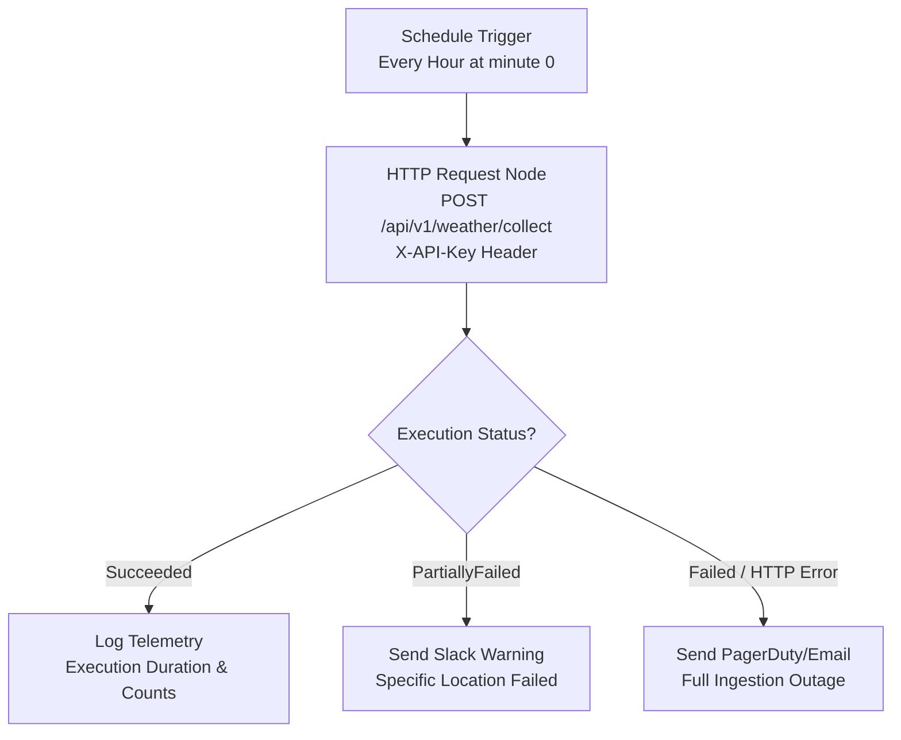

# VarnAI WeatherSense — n8n Orchestration & Integration Guide

## 1. Architectural Role of n8n

In the **VarnAI WeatherSense** architecture, all background scheduling is externalized to **n8n**, a robust open-source workflow automation platform. 

Instead of hosting scheduled jobs inside the .NET process (via Quartz, Hangfire, or `BackgroundService`), the .NET 10 API exposes a headless trigger endpoint:
```http
POST /api/v1/weather/collect
```

### Key Advantages:
1. **Zero Resource Contention**: The Web API does not burn background CPU or threadpool workers for scheduling loops, ensuring ultra-low latency for user queries.
2. **Horizontal Scalability**: If the Web API is scaled to 5 container replicas, n8n hits the load-balanced URL once per hour; no distributed database locks (`sp_getapplock`) are required to prevent duplicate runs.
3. **Visual Observability**: Operations teams can monitor execution history, latency graphs, and payload traces in the n8n web dashboard.
4. **Instant Alerting**: n8n can immediately route alerts to WhatsApp, Slack, Telegram, or email if an execution encounters partial or full provider failures.

---

## 2. Recommended Workflow Architecture



---

## 3. Node Configuration Details

### 3.1 Schedule Trigger Node
- **Trigger Type**: Interval or Cron Expression
- **Cron Expression**: `0 * * * *` (Runs at the top of every hour)
- **Timezone**: `Asia/Kolkata`

### 3.2 HTTP Request Node
- **Method**: `POST`
- **URL**: `http://localhost:5270/api/v1/weather/collect` *(or internal Docker/K8s service DNS: `http://weathersense-api:8080/api/v1/weather/collect`)*
- **Authentication**: Generic Credential Type -> Header Auth (or direct headers)
- **Headers**:
  - `X-API-Key`: `{{ $env.WEATHERSENSE_API_KEY }}`
  - `Content-Type`: `application/json`
  - `X-Correlation-ID`: `n8n-{{ $now.toMillis() }}`
- **Send Body**: `true`
- **Body Content Type**: `JSON`
- **Specify Body**:
```json
{
  "locationIds": [],
  "triggerSource": "N8nWorkflow"
}
```
*(Sending an empty `locationIds` array instructs WeatherSense to query and poll all active locations).*
- **Options**:
  - **Timeout**: `60000` (60 seconds to accommodate multi-location network latency)
  - **Never Error (Continue on Fail)**: `true` (Allows branching into custom error-alert nodes)

### 3.3 If / Switch Node (Status Check)
- **Condition 1**: `{{ $json.status }}` equals `Succeeded`
- **Condition 2**: `{{ $json.status }}` equals `PartiallyFailed`
- **Condition 3**: Default / `Failed`

---

## 4. Ready-to-Import n8n Workflow JSON

You can import the following workflow directly into your n8n instance:
1. Open your n8n dashboard.
2. Click the `...` menu in the top-right corner -> **Import from File / Clipboard**.
3. Paste the JSON below:

```json
{
  "name": "VarnAI WeatherSense Hourly Collector",
  "nodes": [
    {
      "parameters": {
        "rule": {
          "interval": [
            {
              "field": "hours",
              "hoursInterval": 1
            }
          ]
        }
      },
      "id": "11111111-2222-3333-4444-555555555555",
      "name": "Hourly Schedule Trigger",
      "type": "n8n-nodes-base.scheduleTrigger",
      "typeVersion": 1.1,
      "position": [240, 300]
    },
    {
      "parameters": {
        "method": "POST",
        "url": "http://localhost:5270/api/v1/weather/collect",
        "sendHeaders": true,
        "headerParameters": {
          "parameters": [
            {
              "name": "X-API-Key",
              "value": "varnai-weathersense-dev-key-2026"
            },
            {
              "name": "Content-Type",
              "value": "application/json"
            }
          ]
        },
        "sendBody": true,
        "specifyBody": "json",
        "jsonBody": "{\n  \"locationIds\": [],\n  \"triggerSource\": \"N8nWorkflow\"\n}",
        "options": {
          "timeout": 60000
        }
      },
      "id": "22222222-3333-4444-5555-666666666666",
      "name": "Trigger WeatherSense Collection",
      "type": "n8n-nodes-base.httpRequest",
      "typeVersion": 4.2,
      "position": [460, 300]
    },
    {
      "parameters": {
        "conditions": {
          "string": [
            {
              "value1": "={{ $json.status }}",
              "operation": "equal",
              "value2": "Succeeded"
            }
          ]
        }
      },
      "id": "33333333-4444-5555-6666-777777777777",
      "name": "Check Collection Status",
      "type": "n8n-nodes-base.if",
      "typeVersion": 1,
      "position": [680, 300]
    },
    {
      "parameters": {
        "content": "=WeatherSense collection finished successfully.\nExecution ID: {{ $json.executionId }}\nDuration: {{ $json.durationMs }}ms\nObservations: {{ $json.observationsPersistedCount }}\nForecasts: {{ $json.forecastsPersistedCount }}"
      },
      "id": "44444444-5555-6666-7777-888888888888",
      "name": "Log Success",
      "type": "n8n-nodes-base.noOp",
      "typeVersion": 1,
      "position": [920, 200]
    },
    {
      "parameters": {
        "content": "=WARNING: WeatherSense collection partially failed or failed!\nStatus: {{ $json.status }}\nExecution ID: {{ $json.executionId }}\nFailed Locations: {{ $json.failedLocationsCount }}\nDetails: {{ JSON.stringify($json.errorDetails) }}"
      },
      "id": "55555555-6666-7777-8888-999999999999",
      "name": "Alert Operator",
      "type": "n8n-nodes-base.noOp",
      "typeVersion": 1,
      "position": [920, 400]
    }
  ],
  "connections": {
    "Hourly Schedule Trigger": {
      "main": [
        [
          {
            "node": "Trigger WeatherSense Collection",
            "type": "main",
            "index": 0
          }
        ]
      ]
    },
    "Trigger WeatherSense Collection": {
      "main": [
        [
          {
            "node": "Check Collection Status",
            "type": "main",
            "index": 0
          }
        ]
      ]
    },
    "Check Collection Status": {
      "main": [
        [
          {
            "node": "Log Success",
            "type": "main",
            "index": 0
          }
        ],
        [
          {
            "node": "Alert Operator",
            "type": "main",
            "index": 0
          }
        ]
      ]
    }
  },
  "active": true,
  "settings": {
    "executionOrder": "v1"
  }
}
```
*(Replace the "Alert Operator" No-Op node with your organization's Slack webhook, Discord bot, or SMTP Email node).*
